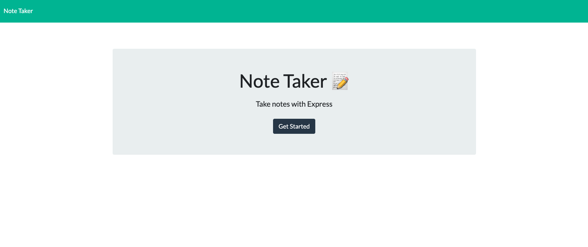
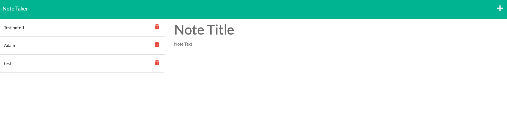
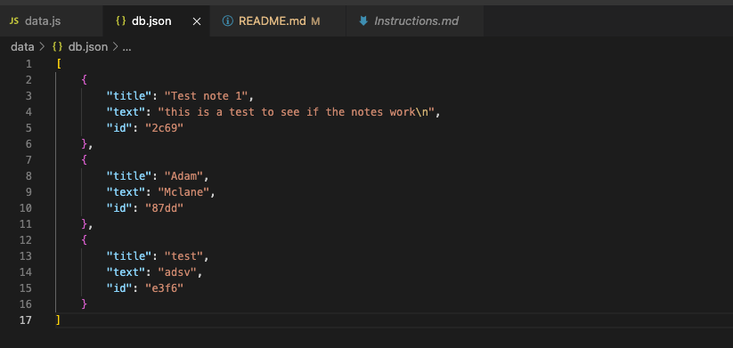

# NoteTaker

## Description
This project is used to understand making a server.  We have two webpages that are connected when the server is running and you can add and delete notes.  The notes that are added or deleted are taken in and out of the db.json file so they are always there when needed and how the user created them.

## My Task / User Story
My task was to create a server with the starter code provided and have it interact with the user in the correct way by adding notes to the db.json file.

## List of Technologies Used
 - npm
 - HTML
 - node.js
 - .gitignore
 - javascript
 - express
 - routes
 - heroku

 ## GitHub URL

 https://github.com/mclanea92/NoteTaker


 ## Page URL (Heroku)

 https://agile-eyrie-33498.herokuapp.com/

 ## Acceptance Citeria
 ```
GIVEN a note-taking application
WHEN I open the Note Taker
THEN I am presented with a landing page with a link to a notes page
WHEN I click on the link to the notes page
THEN I am presented with a page with existing notes listed in the left-hand column, plus empty fields to enter a new note title and the note’s text in the right-hand column
WHEN I enter a new note title and the note’s text
THEN a Save icon appears in the navigation at the top of the page
WHEN I click on the Save icon
THEN the new note I have entered is saved and appears in the left-hand column with the other existing notes
WHEN I click on an existing note in the list in the left-hand column
THEN that note appears in the right-hand column
WHEN I click on the Write icon in the navigation at the top of the page
THEN I am presented with empty fields to enter a new note title and the note’s text in the right-hand column
```

## Tests
To run a test on this project, you have to download npm express and initilize it.  Once you do that, use server 3001 as it is specified in the server.js code.  Run the server and jump into your browser and put in localhost:3001 and it should be running in your browser.  

## Questions
If you have any questions about this project, please feel free to contact me at mclanea92@gmail.com

## Screenshots

The first screenshot is the page you get when you first start the server



The screenshot below is after you get started, what the notes page looks like.


This screenshot below is the db.json in the code that holds the notes that user added and will load everytime this application is loaded.


## License
MIT License

Copyright (c) 2022 Adam McLane

Permission is hereby granted, free of charge, to any person obtaining a copy
of this software and associated documentation files (the "Software"), to deal
in the Software without restriction, including without limitation the rights
to use, copy, modify, merge, publish, distribute, sublicense, and/or sell
copies of the Software, and to permit persons to whom the Software is
furnished to do so, subject to the following conditions:

The above copyright notice and this permission notice shall be included in all
copies or substantial portions of the Software.

THE SOFTWARE IS PROVIDED "AS IS", WITHOUT WARRANTY OF ANY KIND, EXPRESS OR
IMPLIED, INCLUDING BUT NOT LIMITED TO THE WARRANTIES OF MERCHANTABILITY,
FITNESS FOR A PARTICULAR PURPOSE AND NONINFRINGEMENT. IN NO EVENT SHALL THE
AUTHORS OR COPYRIGHT HOLDERS BE LIABLE FOR ANY CLAIM, DAMAGES OR OTHER
LIABILITY, WHETHER IN AN ACTION OF CONTRACT, TORT OR OTHERWISE, ARISING FROM,
OUT OF OR IN CONNECTION WITH THE SOFTWARE OR THE USE OR OTHER DEALINGS IN THE
SOFTWARE.
